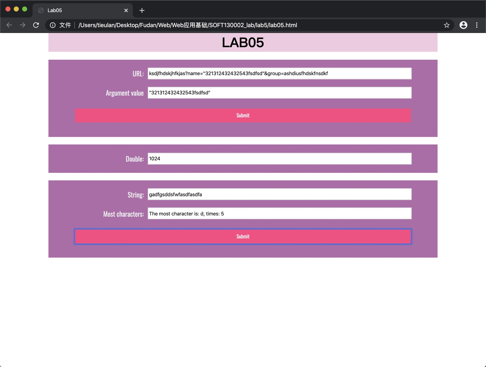

# Lab5开发文档
* 网页效果图如下:

* 解决方案：

    * showWindowHref:  
    先用split函数将字符串根据"&"进行分割，再对所得数组进行遍历,字符串的match方法：利用正则表达式进行匹配，并提取name的参数值
    * timeTest:  
    使用了Date对象的getSeconds方法获取当前时间（便于实现函数在整分钟时停止运行），使用setInterval函数让timeTest函数每五秒运行一次
    * arrSameStr:  
    遍历字符串，将出现的字符串存储到arr对象中，并记录每个字符出现的次数；再对arr对象中的成员变量进行遍历，获取出现最多的字符和出现的次数
    
